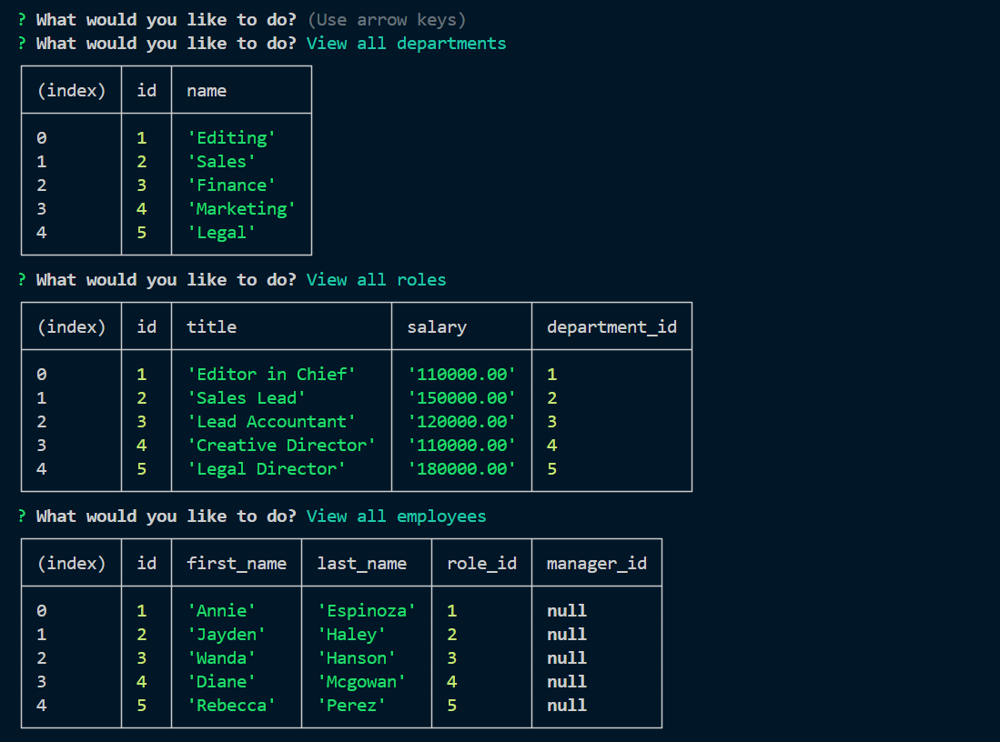
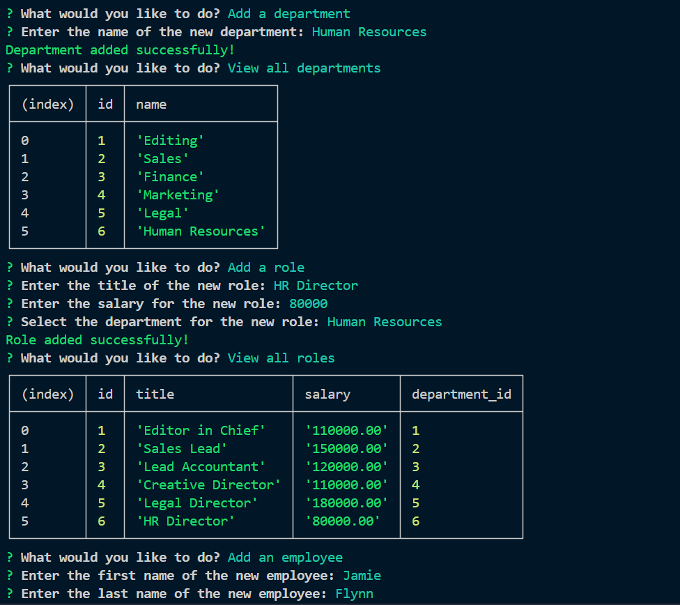

# MySQL-CMS
A simple command-line content management system for managers to track employee database. In the future, I would implement additional functionality such as: update employee manager, view employee by manager, view employee by department, and delete departments, roles, and employees. 

Check out the 
[Link to Walkthrough Video](https://drive.google.com/file/d/1HreF63jXN_tCWOu0hgZMp-9JwMC7fhy2/view)

Here's what it looks like in the command line:

  ## Technologies Used

  Express 4.17.1

  Inquirer 8.2.4

  MySQL 3.9.2

  dotenv 16.4.5

  chalk 4.0.0

  ## Credits

 * Class notes

* [Config file help](https://github.com/jpd61/employee-tracker/tree/master)

* [NPM Chalk](https://www.npmjs.com/package/chalk)

* Copilot

## License

This project is licensed under the MIT license.

